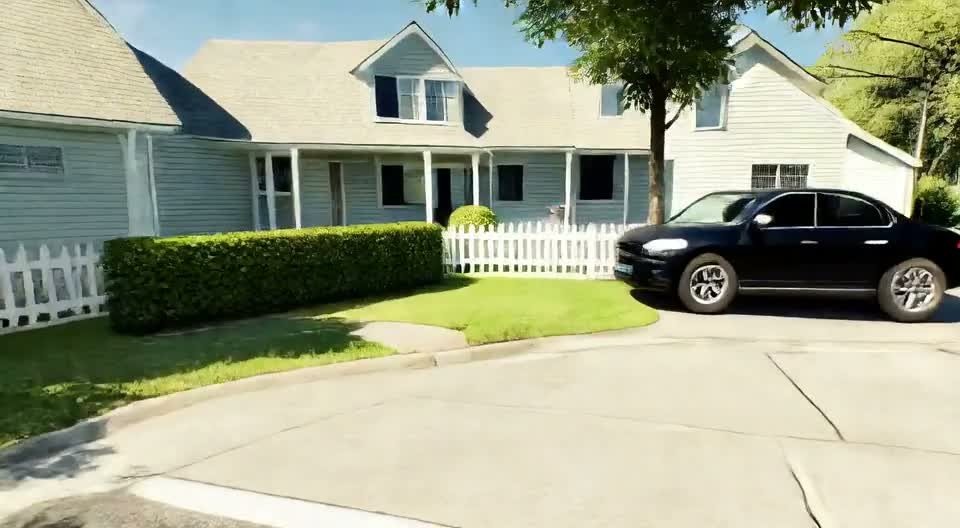

# Suburban street: six-block distilled example

This bundled case provides a complete six-block distilled inference example.

[](preview.mp4)

```bash
CUDA_VISIBLE_DEVICES=0 python infer_distilled.py \
  --config configs/infer_distilled_6blocks.yaml \
  --checkpoint checkpoints/distilled-first-person.safetensors \
  --image samples/distilled/suburban_street_6blocks/input.png \
  --camera samples/distilled/suburban_street_6blocks/camera.npz \
  --caption samples/distilled/suburban_street_6blocks/caption.json \
  --output result.mp4
```

The case contains one 1280 x 704 anchor image, 505 camera poses
(`1 + 84 x 6`), six aligned prompt segments, and a compressed 505-frame
preview without UI or frame numbers.
